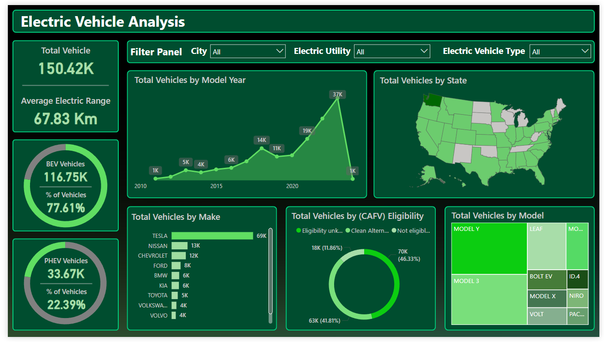

# Electric-Vehicle-Market-Data-Insights

## Overview
This project focuses on analyzing the electric vehicle (EV) market to uncover insights into market trends, vehicle types, sales growth, and environmental impacts. The analysis provides a comprehensive understanding of the EV industry's performance and future opportunities.

## Dashboard

## Key Features

1. **Data Cleaning**  
   - Processed raw EV market data using **Excel**.  
   - Addressed **outliers**, **missing values**, and **unwanted entries** to ensure accurate insights.

2. **Market Insights**  
   - Analyzed a market of **150k EV vehicles**, with an electric range of **67 km**.  
   - Segmented market distribution using **donut charts**:  
     - **116k BEVs (77.6%)**.  
     - **33.6k PHEVs (22.3%)**.  
   - Identified a **30% increase in EV sales** over 5 years, with **37k vehicles sold in 2023**.

3. **Industry Leadership and Environmental Impact**  
   - Highlighted **Tesla's leadership**, manufacturing and selling **69k vehicles**.  
   - Evaluated the environmental benefits, noting that **77% of EVs use clean electric fuel**, significantly reducing air and sound pollution.

## Tools and Techniques
- **Data Cleaning**: Excel.  
- **Data Visualization**: Donut charts, trend analysis.  
- **Key Metrics**: Sales growth (YoY), market share (BEV vs. PHEV).

## Insights
- EV sales have experienced significant growth, with BEVs dominating the market.  
- Tesla leads in manufacturing and sales, setting benchmarks for the industry.  
- Adoption of clean energy in EVs contributes to sustainability and pollution reduction.

## Future Scope
- Explore charging infrastructure's impact on EV adoption.  
- Include a wider range of metrics for regional EV analysis.  
- Predict future EV trends using machine learning models.
